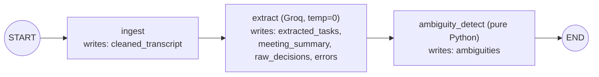
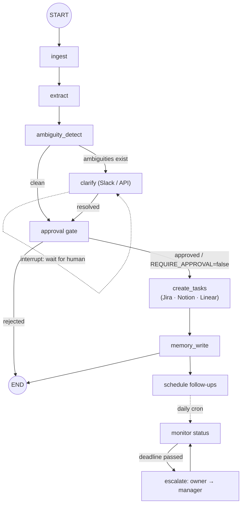

# AI Meeting-to-Execution Agent

## Full Production-Grade Architecture (Claude.md Context File)

---

# 1. Project Overview

## Mission

Transform meeting transcripts into executable, trackable workflows using
a stateful, production-grade AI agent system.

The system:

- Ingests meeting transcripts
- Extracts structured action items
- Resolves ambiguities
- Creates tasks in external systems
- Tracks execution
- Performs automated follow-ups and escalation
- Maintains long-term organizational memory

---

# 1A. Implementation Status (Living Section)

> Keep this section in sync with the code. Sections 2–15 describe the **target**
> production architecture; this section describes **what exists today** so a new
> contributor (or future AI session) does not assume unbuilt infrastructure is
> present.

## Current phase: Phase 1 ✅ complete and verified

A transcript is `POST`ed over HTTP, a **linear** LangGraph runs
`ingest → extract → ambiguity_detect`, and validated JSON comes back. There is
**no** database, Redis, vector store, human-in-the-loop, or external task
creation yet — those are Phases 2–7.

### What is actually wired (Phase 1)

| Concern | Reality today |
| --- | --- |
| Orchestration | LangGraph `StateGraph(MeetingState)`, **linear** edges, compiled once via `@lru_cache` ([`graph/workflow.py`](graph/workflow.py)) |
| State | In-memory `MeetingState` only — **not** persisted; no checkpointer |
| LLM | Groq via `langchain-groq`, `temperature=0`, `with_structured_output(ExtractedMeetingPayload)`, default model `qwen/qwen3-32b` |
| Ambiguity | Pure-Python rules, no LLM ([`graph/ambiguity_rules.py`](graph/ambiguity_rules.py)) |
| API | `POST /v1/workflows/from-transcript`, plus `/health` and `/health/config` |
| Config | `pydantic-settings` from `.env`; `run_id`/`thread_id` generated per request but **not** used for resume yet |
| Observability | One JSON log line per node (`run_id`, `node`, `duration_ms`); no OTel/Prometheus |
| Reliability | LLM call has `max_retries=2`; extraction failure appends to `errors[]` and returns empty tasks (no crash). No idempotency keys / circuit breaker yet |
| Tests | `pytest` (pure-function unit tests + mocked-LLM API test), `ruff` clean |

### Repository map

```text
app/main.py             FastAPI entrypoint, /health, /health/config
app/config.py           Settings (groq_model, thresholds, REQUIRE_APPROVAL)
app/api/v1/workflows.py POST /v1/workflows/from-transcript
graph/workflow.py       Build + compile graph; run_from_transcript()
graph/nodes/ingest.py   Normalize transcript → cleaned_transcript
graph/nodes/extract.py  Groq structured extraction → tasks/summary
graph/nodes/ambiguity.py Rule-based ambiguity detection
graph/ingest_utils.py   normalize_transcript() (pure)
graph/ambiguity_rules.py collect_ambiguities() (pure)
schemas/                Pydantic contracts: state, tasks, extraction,
                        ambiguity, enums, api, errors
tools/ workers/         Empty placeholders (Phase 3 / Phase 6)
tests/                  Unit + mocked-API tests, fixtures/
scripts/groq_smoke.py   One-off live Groq check
```

### Key constants (tune in `.env` / `app/config.py`)

- `GROQ_MODEL` default `qwen/qwen3-32b`
- `EXTRACTION_CONFIDENCE_THRESHOLD` default `0.5` (below ⇒ `low_confidence` ambiguity)
- `TRANSCRIPT_MAX_CHARS` default `120000` (truncate + warn)
- `REQUIRE_APPROVAL` default `false` (no effect until Phase 2)

### Phase 1 graph (implemented)



### Target graph (Phases 2–6) — where the linear flow grows branches



### Design-vs-reality notes (do not get surprised)

- **State is not persisted.** §5 says "State is persisted in PostgreSQL" — that
  is the Phase 4 target. Today state lives only for the duration of one request.
- **`MeetingState` has more fields than §5 lists** — see the corrected, accurate
  definition in §5 below (`cleaned_transcript`, `meeting_summary`,
  `raw_decisions`, `approval_status`, etc.).
- **`thread_id` is generated but unused** — reserved for Phase 2 checkpoint/resume.
- **Single LLM (Groq) only.** The §8 model-router (separate models for
  ambiguity/summary/fallback) is not built; ambiguity detection is pure Python.
- **No Slack/Jira/Notion/Redis/vector DB/OTel** despite being in the stack list —
  they are sequenced in [`docs/IMPLEMENTATION_PLAN.md`](docs/IMPLEMENTATION_PLAN.md).

---

# 2. Core Architecture Philosophy

This is NOT a chatbot. This is a stateful, deterministic + agentic
workflow engine.

Architecture principles:

- Graph-based orchestration (LangGraph)
- Explicit state management
- Separation of reasoning vs tool execution
- Deterministic control flow where required
- Memory layers (STM + LTM)
- Human-in-the-loop checkpoints
- Observability-first design
- Production reliability (retry, timeout, fallback)

---

# 3. High-Level System Architecture

```text
User / API Trigger
        │
        ▼
   FastAPI Backend  (stateless)
        │
        ▼
   LangGraph Orchestrator  (stateful)
        │
        ├─ Transcript Ingestion
        ├─ Action Extraction
        ├─ Ambiguity Detection
        ├─ Clarification Loop ──┐  (human-in-the-loop)
        ├─ Approval Gate  ◄─────┘
        ├─ Task Creation (tool nodes: Jira · Notion · Linear · Slack)
        └─ Memory Write (Vector DB + PostgreSQL)
        │
        ▼
   Scheduler / Monitoring Agent ──► Follow-up / Escalation Engine
```

The rendered, phase-annotated version of this flow lives in §1A above and in
[`README.md`](README.md). Solid boxes in §1A are built (Phase 1); the rest are
sequenced across Phases 2–7.

---

# 4. Technology Stack

## Core Agent Layer

- LangGraph (stateful graph orchestration)
- LangChain (tool abstraction, structured outputs)
- Deep Agents framework (optional advanced abstraction)
- GROQ (LLM inference provider)
- OpenAI / Anthropic fallback models

## Backend

- FastAPI
- Uvicorn
- Pydantic v2
- PostgreSQL (persistent graph state)
- Redis (short-term memory cache + job queue)

## Memory

- Vector DB (Chroma / Pinecone / Weaviate)
- Embedding model (OpenAI / bge-large)
- PostgreSQL for structured memory

## Tool Integrations

- Slack API
- Jira API
- Notion API
- Google Calendar API
- Email (SMTP / Gmail API)

## Observability

- OpenTelemetry
- Structured logging (JSON logs)
- Prometheus + Grafana

## Deployment

- Docker
- Kubernetes (optional)
- CI/CD pipeline (GitHub Actions)

---

# 5. LangGraph Design

## State Object

Accurate as implemented in [`schemas/state.py`](schemas/state.py) (Pydantic v2).
LangGraph coerces each node's dict update into this model.

```python
class MeetingState(BaseModel):
    transcript: str = ""                       # raw input (Phase 1)
    cleaned_transcript: str | None = None      # ingest node (Phase 1)
    extracted_tasks: list[Task] = []           # extract node (Phase 1)
    ambiguities: list[Ambiguity] = []          # ambiguity node (Phase 1)
    meeting_summary: str | None = None         # extract node (Phase 1)
    raw_decisions: list[str] | None = None     # extract node (Phase 1)
    errors: list[str] = []                     # append-only, any node (Phase 1)

    clarified_tasks: list[Task] = []           # HITL (Phase 2)
    approval_status: ApprovalStatus = PENDING  # approval gate (Phase 2)
    created_task_ids: list[str] = []           # tool nodes (Phase 3)
    memory_refs: list[str] = []                # memory write (Phase 5)
    followup_schedule: dict = {}               # scheduler (Phase 6)
```

> **Reality check:** State is **in-memory only** in Phase 1. Durable
> persistence in PostgreSQL (via a LangGraph checkpointer) is the **Phase 4**
> target, not current behavior. `Task` and `Ambiguity` are defined in
> [`schemas/tasks.py`](schemas/tasks.py) and [`schemas/ambiguity.py`](schemas/ambiguity.py);
> `ApprovalStatus` / `AmbiguityKind` in [`schemas/enums.py`](schemas/enums.py).

---

# 6. Graph Nodes

## 1. Transcript Ingestion Node

- Input: raw transcript
- Output: cleaned structured transcript
- Preprocessing:
  - Speaker segmentation
  - Noise removal
  - Chunking if  context window

## 2. Action Extraction Node

- Uses structured output (Pydantic schema)
- Extracts:
  - Task title
  - Description
  - Owner
  - Deadline
  - Dependencies
  - Confidence score

Model: GROQ-hosted LLM (fast inference)

## 3. Ambiguity Detection Node

- Checks missing owner or deadline
- Checks low confidence
- Adds clarification prompts

## 4. Clarification Loop Node

- If ambiguity exists:
  - Sends Slack message
  - Waits for human response
  - Updates state
- Loop until resolved

## 5. Human Approval Gate

- Summary generated
- Sent to meeting organizer
- Requires explicit confirmation

## 6. Task Creation Node (Tool Node)

- Deterministic execution
- Creates tasks in:
  - Jira
  - Notion
- Retry policy:
  - Exponential backoff
  - Max 3 retries

## 7. Memory Write Node

- Store embeddings in vector DB
- Store structured task record in PostgreSQL
- Create relationship graph (optional)

## 8. Scheduler Node

- Background cron
- Checks task status daily
- Triggers follow-up agent

## 9. Escalation Node

- If deadline passed:
  - Notify owner
  - Notify manager after threshold

---

# 7. Memory Architecture

## Short-Term Memory (STM)

- Redis
- Holds active workflow context
- TTL-based expiry
- Used during clarification loop

## Long-Term Memory (LTM)

### 1. Vector Memory

Stores: - Meeting summaries - Decisions - Task embeddings

Used for: - Retrieval during future meetings - Trend detection

### 2. Structured Memory

PostgreSQL tables: - meetings - tasks - decisions - stakeholders -
followups

---

# 8. LLM Routing Strategy

Model Router: - GROQ for extraction (low latency) - Higher-quality model
for ambiguity resolution - Smaller model for summarization - Fallback
model on failure

---

# 9. Reliability Engineering

## Retry Strategy

- Tool calls wrapped in retry decorator
- Circuit breaker pattern

## Timeout Handling

- Node-level timeouts
- Kill long-running execution

## Idempotency

- Task creation uses idempotency keys
- Prevent duplicate ticket creation

---

# 10. Observability

Each graph execution logs: - Node transitions - Latency per node - Tool
call duration - Model token usage - Failure points

Tracing via OpenTelemetry.

---

# 11. Security Considerations

- API authentication (JWT)
- Role-based access control
- Audit logs for task creation
- Encrypted vector store
- Secret management via environment variables

---

# 12. Scalability

Horizontal Scaling: - Stateless API layer - Shared Postgres - Redis
cluster - Worker queue for async nodes

Batch meeting processing supported.

---

# 13. Future Extensions

- Multi-agent role separation
- Predictive deadline risk detection
- Performance analytics dashboard
- Automatic meeting agenda generation
- Organizational knowledge graph

---

# 14. Development Phases

Phase 1: Core graph + extraction  
Phase 2: Tool integrations  
Phase 3: Memory layer  
Phase 4: Follow-up automation  
Phase 5: Observability + hardening  
Phase 6: Production deployment

---

# 15. Definition of Done

The system is production-ready when:

- Graph state persists across crashes
- Task duplication impossible
- All tool calls retriable
- Monitoring dashboards active
- Memory retrieval validated
- SLA metrics defined

---

END OF CLAUDE CONTEXT FILE