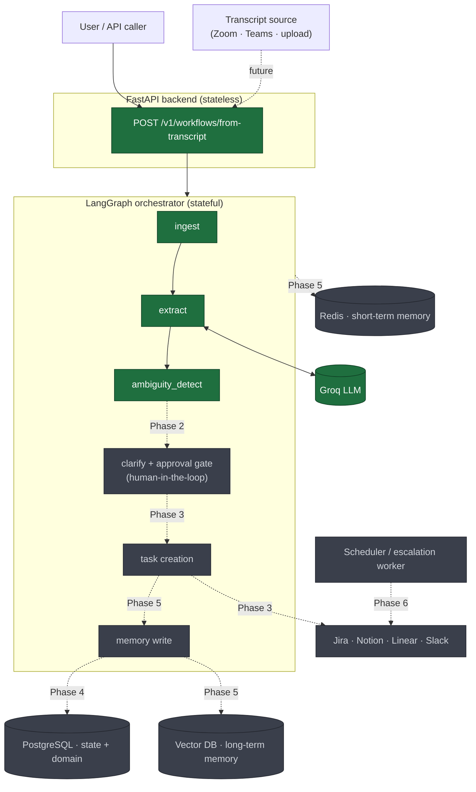
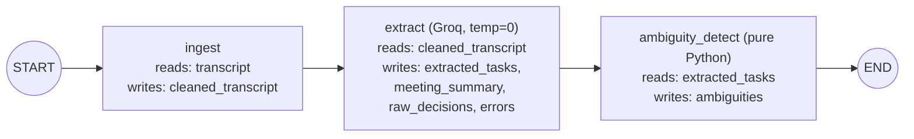
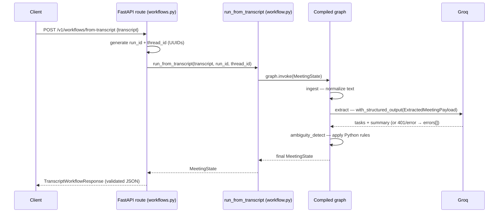
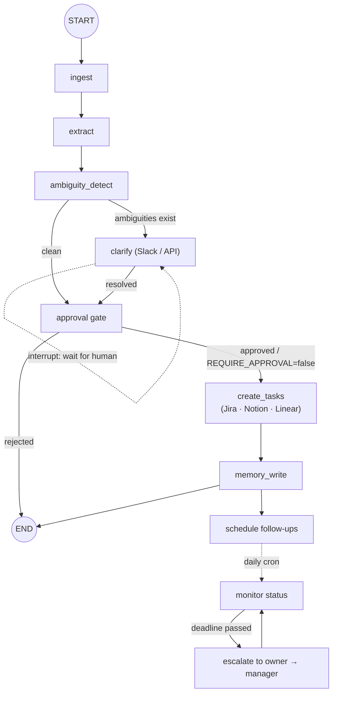

# Meeting-to-Execution Agent

Turn raw meeting transcripts into structured, trackable action items using a
stateful **LangGraph** workflow — not a chatbot. See [`CLAUDE.md`](CLAUDE.md)
for the full architecture and [`docs/IMPLEMENTATION_PLAN.md`](docs/IMPLEMENTATION_PLAN.md)
for the phased roadmap.

> **Status:** Phase 1 complete and verified. A transcript goes in over HTTP, the
> graph runs `ingest → extract → ambiguity_detect`, and structured tasks plus
> rule-based ambiguity flags come back as JSON. No external task systems, no
> human-in-the-loop, and no database yet — those are later phases.

---

## What it does (today)

1. You `POST` a meeting transcript to one endpoint.
2. The **ingest** node normalizes the text (trim, collapse whitespace, cap length).
3. The **extract** node asks a Groq LLM to return tasks that match a fixed
   Pydantic schema (title, owner, deadline, dependencies, confidence) — at
   `temperature=0` for repeatable output.
4. The **ambiguity** node runs *pure Python* rules over those tasks and flags
   anything missing an owner or deadline, below the confidence threshold, or
   pointing at a dependency that doesn't exist.
5. You get back validated JSON: the cleaned transcript, the tasks, the
   ambiguities, and any errors.

The guiding idea: **the model proposes structure; deterministic code enforces
the rules.** That split is what makes this an engineered workflow rather than a
prompt.

---

## Architecture & workflow

### 1. High-level system (target — all phases)

This is where the project is heading. Solid arrows are built today; dotted
arrows are future phases, labeled with the phase that introduces them.



### 2. Phase 1 graph (implemented)

The compiled LangGraph today is strictly linear. Each node receives the shared
`MeetingState`, returns a partial update, and LangGraph merges it before the
next node runs.



### 3. Request lifecycle (Phase 1 sequence)

What actually happens on a single HTTP call, file by file.



### 4. Target LangGraph state machine (all phases)

Where the linear graph grows conditional edges, a human-in-the-loop interrupt,
and a background monitoring loop.



### How the state object fills up over the phases

`MeetingState` ([`schemas/state.py`](schemas/state.py)) is the single shared
object threaded through every node. Phase 1 fills the first block; the rest are
reserved fields that later phases populate.

| Field | Filled by | Phase |
|---|---|---|
| `transcript` | API request | 1 ✅ |
| `cleaned_transcript` | `ingest` node | 1 ✅ |
| `extracted_tasks`, `meeting_summary`, `raw_decisions` | `extract` node | 1 ✅ |
| `ambiguities` | `ambiguity_detect` node | 1 ✅ |
| `errors` | any node (append-only) | 1 ✅ |
| `clarified_tasks`, `approval_status` | HITL + approval gate | 2 |
| `created_task_ids` | task-creation tools | 3 |
| `memory_refs` | memory-write node | 5 |
| `followup_schedule` | scheduler | 6 |

---

## Project structure

```text
app/                     # FastAPI app + config
  main.py                #   entrypoint, /health, /health/config
  config.py              #   pydantic-settings (model, thresholds, flags)
  api/v1/workflows.py    #   POST /v1/workflows/from-transcript
graph/                   # LangGraph definition
  workflow.py            #   builds + compiles the graph (cached)
  nodes/ingest.py        #   normalize transcript
  nodes/extract.py       #   Groq structured extraction
  nodes/ambiguity.py     #   rule-based ambiguity detection
  ingest_utils.py        #   normalize_transcript() — pure function
  ambiguity_rules.py     #   collect_ambiguities() — pure function
schemas/                 # Pydantic contracts (shared import surface)
  state.py               #   MeetingState (graph state)
  tasks.py               #   Task
  extraction.py          #   ExtractedMeetingPayload (LLM output schema)
  ambiguity.py, enums.py #   Ambiguity + AmbiguityKind / ApprovalStatus
  api.py, errors.py      #   request/response bodies, ApiError
tools/  workers/         # placeholders for Phase 3 / Phase 6
tests/                   # unit + mocked-API tests, fixtures/
scripts/groq_smoke.py    # one-off live LLM check
```

---

## Setup

```bash
uv sync --extra dev
cp .env.example .env   # Windows: copy .env.example .env — then set GROQ_API_KEY when using the LLM
```

This repo also ships a local `.venv`. Either works:

```bash
# Windows (.venv directly)
.venv/Scripts/python.exe -m uvicorn app.main:app --reload
.venv/Scripts/python.exe -m pytest
```

## Run API (Phase 1)

```bash
uv run uvicorn app.main:app --reload
```

- [http://127.0.0.1:8000/health](http://127.0.0.1:8000/health)
- [http://127.0.0.1:8000/health/config](http://127.0.0.1:8000/health/config) (no secrets; shows whether `GROQ_API_KEY` is set)
- **Phase 1 workflow:** `POST http://127.0.0.1:8000/v1/workflows/from-transcript` with JSON body `{"transcript": "..."}` (requires a valid `GROQ_API_KEY` for real extraction).

Example call:

```bash
curl -X POST http://127.0.0.1:8000/v1/workflows/from-transcript \
  -H "Content-Type: application/json" \
  -d '{"transcript": "Alice: I will send the Q3 budget to finance by 2026-07-05. Bob, migrate the DB to Postgres by 2026-07-20."}'
```

If the LLM call fails (bad/expired key, network), the run still returns `200`
with empty `extracted_tasks` and a message in `errors[]` — extraction failure is
a handled path, not a crash.

See [`docs/AGENT_INTERVIEW_PRIMER.md`](docs/AGENT_INTERVIEW_PRIMER.md) for how the
LangGraph flow maps to interview talking points.

## Checks

```bash
uv run pytest
uv run ruff check .
```

## Optional LLM smoke test

Requires a valid `GROQ_API_KEY` in `.env`. Run from the **repository root** (so `app` resolves):

```bash
python scripts/groq_smoke.py
# or
uv run python scripts/groq_smoke.py
```

---

## Phase roadmap

| Phase | Scope | State |
|---|---|---|
| **1** | Core linear graph + structured extraction + ambiguity rules | ✅ Done |
| 2 | Human-in-the-loop: pause/resume via interrupts, approval gate | Next |
| 3 | Tool integrations: Jira / Notion / Linear / Slack, idempotency | Planned |
| 4 | Persistence: LangGraph checkpointer → PostgreSQL | Planned |
| 5 | Memory: Redis (STM) + vector DB (LTM) | Planned |
| 6 | Follow-up, escalation, scheduling | Planned |
| 7 | Production hardening: auth, OTel, Docker, CI | Planned |

Full detail per phase is in [`docs/IMPLEMENTATION_PLAN.md`](docs/IMPLEMENTATION_PLAN.md).
